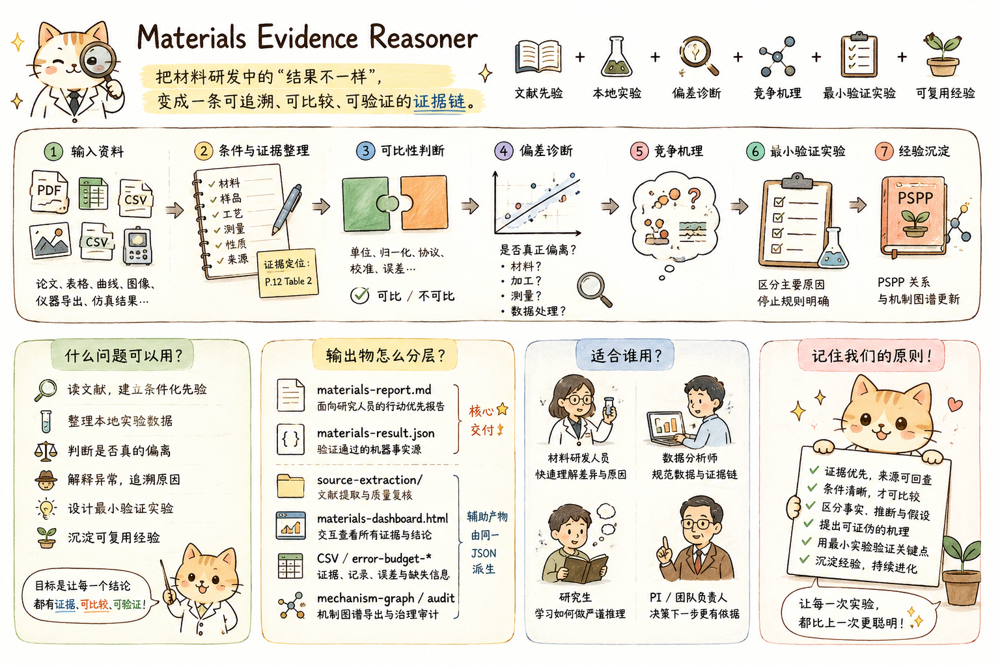
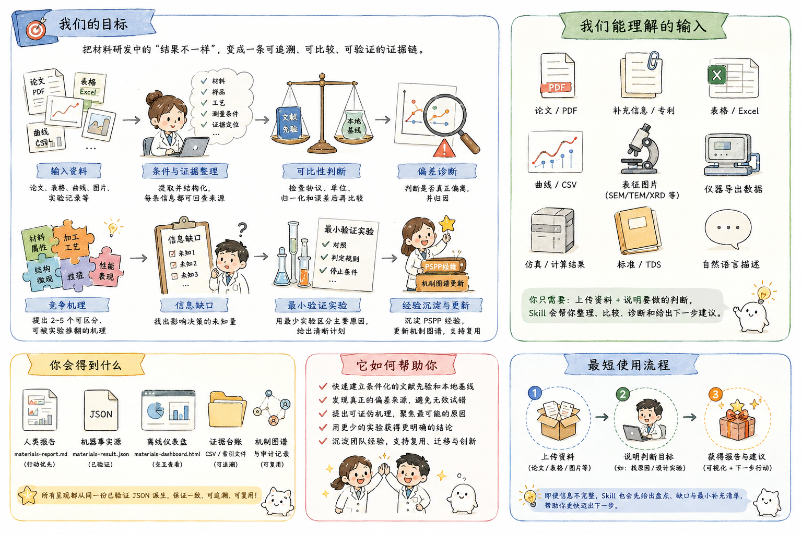
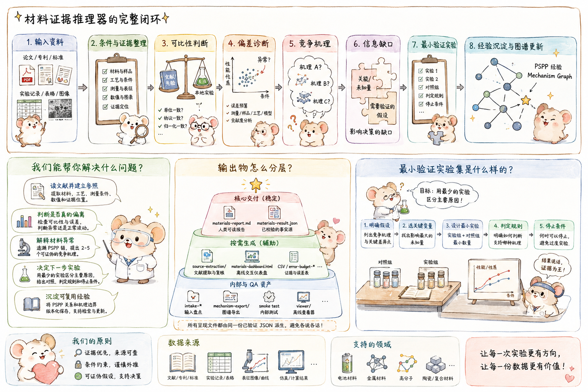
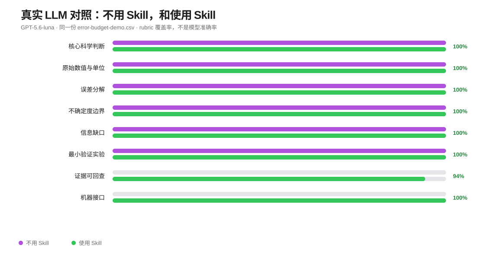
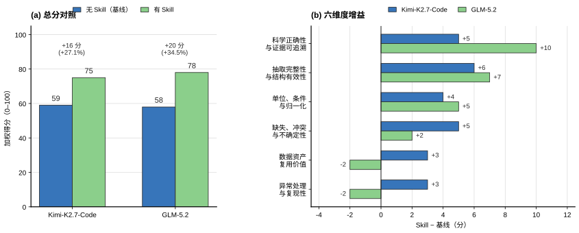
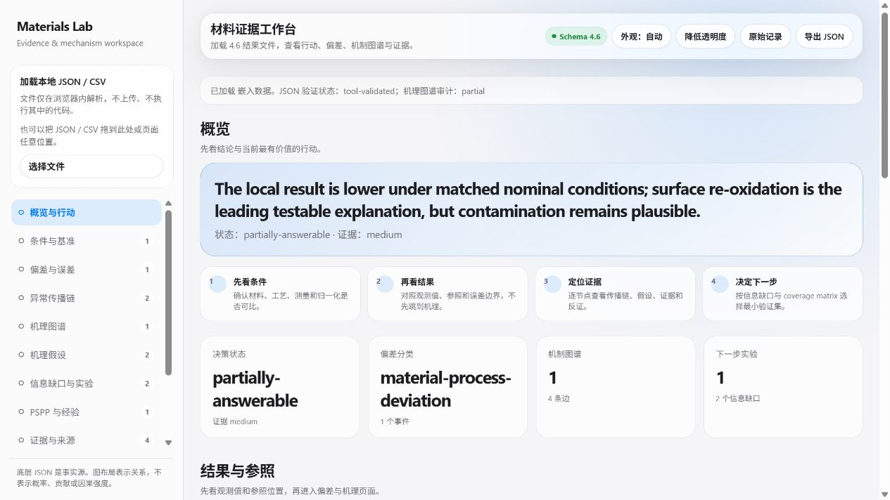
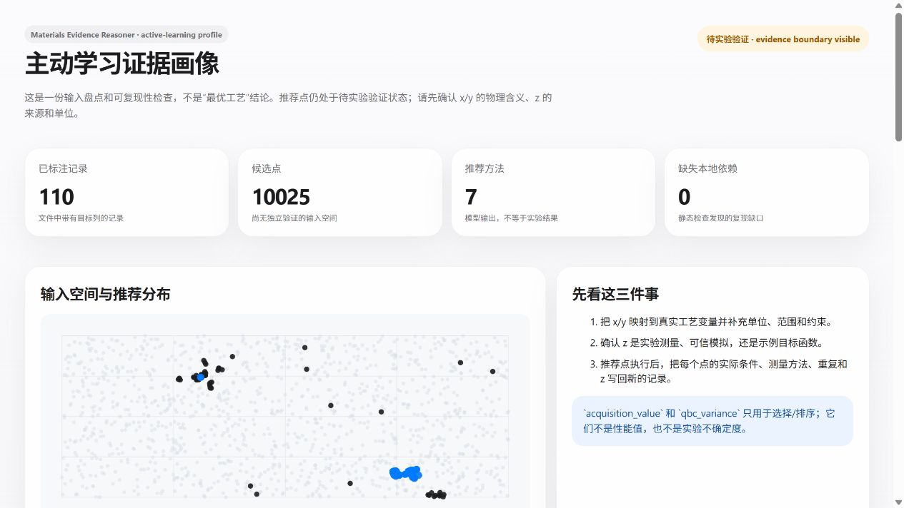

<p align="center">
  
</p>

<h1 align="center">Materials Evidence Reasoner</h1>

<p align="center">
  <strong>把材料研发中的“结果不一样”，变成一条可追溯、可比较、可验证的证据链。</strong><br>
  文献先验 · 本地实验 · 偏差诊断 · 竞争机理 · 最小验证实验 · 可复用经验
</p>

<p align="center">
  
  
  
  
</p>

<p align="center">
  <a href="SKILL.md">Agent Skill</a> ·
  <a href="references/output-schema.json">Output Schema</a> ·
  <a href="viewer/index.html">Offline Viewer</a> ·
  <a href="LICENSE">License</a>
</p>

材料研发真正困难的地方，通常不是“有没有一个答案”，而是不同来源的结果能不能放在同一条件下比较：论文里的最佳样品是否与本地样品同批次、同协议、同归一化方式？一次性能下降究竟来自材料、加工、结构、测量还是数据处理？下一项实验怎样用最少的资源区分主要原因？

Materials Evidence Reasoner 是一个面向材料研发的证据推理 Skill 和配套工具包。它把论文、补充信息、专利、标准、TDS、实验记录、表格、曲线、表征图像和计算结果整理为可回查的数据资产；先经过条件注册和可比性判断，再进入偏差诊断、竞争机理、信息缺口和验证实验。它不会把模型推荐包装成实验事实，也不会因为文本相似就自动宣称普遍因果关系。

## 🧭 工作原理

<p align="center">
  
</p>
<p align="center"><em>从“结果不一样”出发，经过条件、证据、可比性和验证，最后沉淀可复用经验。</em></p>

可访问文本版流程：

```text
输入资料 → 条件与证据整理 → 可比性判断 → 偏差诊断
        → 竞争机理 → 信息缺口 → 最小验证实验
        → PSPP 经验 / Mechanism Graph 更新
```

## 🚀 30 秒看懂

<table>
<tr>
<td width="33%" valign="top">

### 📚 整理证据

论文、实验记录、Excel、曲线、图像和模拟结果统一进入可追溯证据链。

</td>
<td width="33%" valign="top">

### 🔍 解释偏差

先判断是否真的可比，再区分测量、数据、工艺和材料原因。

</td>
<td width="33%" valign="top">

### 🧪 决定下一步

提出可证伪机理，并设计关闭关键信息缺口的最小实验集。

</td>
</tr>
</table>

## 🚀 3 步开始

**1. 上传资料**<br>
论文 / Excel / CSV / 曲线 / 表征图像 / 仪器导出 / 仿真结果

**2. 告诉 Agent 你想判断什么**<br>
例如：判断是否复现失败、找出性能下降的原因、设计下一项验证实验。

**3. 获取结果**<br>
中文报告 · 机器事实源 JSON · 证据表 · 离线 Dashboard · 最小验证实验

> **不需要先学 Schema，也不需要先整理 JSON。** 直接给资料和判断目标即可。

最短的请求可以是：

```text
请整理我上传的 3 个实验批次，并用这 4 篇论文建立 NCM811 的条件化容量先验。
先检查倍率、归一化和电池形式是否可比，再判断偏差、排序竞争机理，
最后给出最小验证实验集、停止规则和可视化报告。
```

Skill 会先盘点输入，把缺失信息分成三类：不补充就无法可靠比较或解释的 blocker、会降低结论强度但不阻断分析的限制项，以及可选增强信息。它不会用“典型值”替你填空；关键事实必须能回到来源、实验记录或用户明确提供的观测。

## 🔬 可以解决什么问题

<table>
<tr>
<td width="50%" valign="top">

- 📚 读文献并建立条件化参照；
- 🧪 整理本地实验与数据谱系；
- ⚖️ 判断结果是可比、波动还是异常；
- 🧩 沿材料属性—加工—结构—性质—性能链解释异常；
- 🧭 用最少实验区分竞争原因；
- 🌱 版本化沉淀 PSPP 与 Mechanism Graph 经验。

</td>
<td width="50%" valign="top">

它不适合做通用论文摘要、自动实验设备控制或凭相似文本发现新材料。它不会访问未授权数据、批准危险实验、证明普遍因果关系或保证实验成功。

</td>
</tr>
</table>

## 🧭 项目图解

用三张图快速了解项目的目标、输入、工作流程和输出。

### 目标与输入

<p align="center">
  
</p>

### 最短使用流程与输出分层

<p align="center">
  
</p>

### 完整闭环与最小验证实验

<p align="center">
  
</p>

## 📦 输出物怎么分层

跨任务稳定的核心交付只有两项：

- `materials-report.md`：面向研究人员的行动优先中文报告；
- `materials-result.json`：通过 Schema 和 `validate_output.py` 校验的机器事实源。

按任务生成的辅助产物包括文献提取交接包、CSV、误差预算、离线 Dashboard、机制图谱导出和审计文件；它们都从同一份 JSON 派生，不成为新的事实来源。

## 🔬 不用 Skill，和使用 Skill，差在哪里？

仓库现在包含一次真实的 **GPT-5.6-luna 对照实验**：同一份 `examples/error-budget-demo.csv`、同一个科研问题、同一个模型，只改变是否加载 Materials Evidence Reasoner。无 Skill 组输出普通研究备忘录；使用 Skill 组读取 `SKILL.md`，运行输入盘点和误差预算工具，生成并通过 canonical JSON 校验。

<p align="center">
  
</p>

这次结果说明一个重要事实：在这份结构清楚的重复测量数据上，**不用 Skill 也可能得到正确的主要科学判断**；Skill 的主要增益是把判断变成有证据绑定、条件边界、信息缺口、可验证实验和机器接口的可交接资产。一次任务、每种模式一次运行，不足以宣称模型普遍提升；它只是一个真实、可复现的起点。

查看完整离线评估：[`examples/skill-effect-real/evaluation.html`](examples/skill-effect-real/evaluation.html)；机器评分与校验状态见 [`examples/skill-effect-real/evaluation.json`](examples/skill-effect-real/evaluation.json)；两组原始输出见 [`examples/skill-effect-real/`](examples/skill-effect-real/)。重新运行评分：

```bash
python scripts/evaluate_real_skill_effect.py
```

底层的确定性合同回归仍保留在 `scripts/compare_skill_modes.py`，用于不依赖模型的包级冒烟测试。

## 📊 项目 A/B 评估：可直接比较的两种模型

这里呈现项目对 **Kimi-K2.7-Code 与 GLM-5.2** 的 A/B 评估结果，统一保留它们各自的 0–100 加权评分口径；GPT-5.6-luna 的独立 rubric 结果只在上面的真实双 Agent 实验中展示，不混入本表和本图。

<p align="center">
  
</p>
<p align="center"><em>图 1. 项目 A/B 评估结果。左：总分；右：六维度差值。数值标签、图例和注释均置于数据区域之外或直接贴近对应柱体。</em></p>

| 模型 | 无 Skill（基线） | 有 Skill | 绝对提升 | 相对提升 | 评分权重 |
|---|---:|---:|---:|---:|---|
| Kimi-K2.7-Code | 59 | 75 | **+16** | **+27.1%** | 30/20/15/15/10/10（官方权重） |
| GLM-5.2 | 58 | 78 | **+20** | **+34.5%** | 30/25/15/10/10/10（报告内权重） |

| 评价维度 | Kimi 基线 → Skill | Kimi Δ | GLM 基线 → Skill | GLM Δ |
|---|---:|---:|---:|---:|
| 科学正确性与证据可追溯 | 22 → 27 | +5 | 12 → 22 | **+10** |
| 抽取完整性与结构有效性 | 12 → 18 | **+6** | 13 → 20 | **+7** |
| 单位、条件与归一化 | 9 → 13 | +4 | 8 → 13 | +5 |
| 缺失、冲突与不确定性 | 7 → 12 | +5 | 6 → 8 | +2 |
| 数据资产复用价值 | 5 → 8 | +3 | 10 → 8 | **−2** |
| 异常处理与复现性 | 4 → 7 | +3 | 9 → 7 | **−2** |
| **总分** | **59 → 75** | **+16** | **58 → 78** | **+20** |

这两个模型的总分方向一致，但六维度权重并不相同，因此不把维度分数跨模型平均。GLM 报告如实保留了“数据资产复用价值”和“异常处理与复现性”各 −2 分，图表也不做正向结果筛选。

完整数据与评分口径见 [`docs/three-model-skill-ab-evaluation.md`](docs/three-model-skill-ab-evaluation.md)；实验排查与下一轮主动学习建议见 [`docs/active-learning-troubleshooting-and-next-experiment.md`](docs/active-learning-troubleshooting-and-next-experiment.md)。图表由 [`scripts/plot_skill_ab_results.py`](scripts/plot_skill_ab_results.py) 基于上述数据重新生成。

## 🖥️ 界面预览

所有页面都可以离线打开，数据只在浏览器内解析，不上传也不执行输入文件中的代码。视觉层采用克制留白、清晰层级、浅/深色适配、状态标签和可回查路径，帮助科研人员先看结论边界，再进入证据细节。

<p align="center">
  
</p>
<p align="center"><em>材料证据工作台：从概览和当前行动开始，再进入条件、偏差、机理和验证页面。</em></p>

<p align="center">
  
</p>
<p align="center"><em>主动学习证据画像：明确区分已标注记录、候选空间、模型推荐和待实验验证状态。</em></p>

## 📝 如果你只给 Agent 一篇文献

你不需要先整理 JSON，也不需要先选择分析模式。直接上传论文 PDF（有补充信息就一起上传），然后告诉 Agent 你的研究问题。可以直接复制：

```text
请使用 materials-evidence-reasoner 做一个 literature-first 审查。
我目前只提供文献，没有本地实验数据。请先检查文件身份和提取质量，再提取材料、样品、工艺、测量条件、图表数值和证据定位；严格区分文献事实、derived、hypothesis 和 missing。
请生成中文报告、source-extraction/source-dashboard.html、materials-result.json 和 materials-dashboard.html；按 references/output-schema.json 输出并运行 scripts/validate_output.py。最后告诉我先看哪个文件、哪些结论需要人工回查、下一步如何接入本地实验。
```

Agent 正确完成后，你按这个顺序使用结果：

1. 打开 `source-extraction/source-dashboard.html`，先确认文献标题、页数、提取状态、表格/图像警告和需要回查的页码。
2. 阅读 `materials-report.md`，它是面向研究人员的主入口，重点看结论、证据限制、信息缺口和“现在该做什么”。
3. 打开 `materials-dashboard.html`，交互查看条件、证据、假设和验证计划；图卡可以继续打开记录详情。
4. 把 `materials-result.json` 当作后续 Agent 的事实源。下一次加入第二篇文献或本地实验时，把这个 JSON 和新文件一起提供，不要手工改字段名。

只有文献时，结果不会证明你的实验已经复现或失败；它提供的是条件化文献先验、证据台账、候选机理、信息缺口和验证入口。更完整的单篇文献请求见 `examples/literature-only-request.md`，用户阅读和后续提问规则见 `references/literature-user-workflow.md`。

<details>
<summary><strong>🛠️ 查看完整执行流程与知识维护</strong></summary>

## 🛠️ 推荐执行顺序

```bash
# 1. 盘点和规范化用户输入
python scripts/prepare_intake.py <file-or-directory> --output intake-output

# 2. 可选：对长表重复数据生成描述性误差预算
python scripts/analyze_error_budget.py repeats.csv --value measurement_value --unit MPa -o error-budget.json --report error-budget.md

# 3. 文献/文档先经过环境感知提取（PDF 默认 Docling，XML/JATS 使用结构化解析）
python scripts/extract_sources.py --check-environment
python scripts/extract_sources.py paper.pdf supplement.xml --output source-extraction

# 3b. 如果输入里有主动学习/贝叶斯优化代码和候选结果，额外生成画像与 Apple 风格交互页
python scripts/profile_active_learning.py <active-learning-folder> --output active-learning-profile

# 4. Agent 按 SKILL.md 生成 materials-result.json

# 5. 校验结构、ID、证据引用和不可比闸门
python scripts/validate_output.py materials-result.json

# 6. 从同一 JSON 生成行动优先报告和离线仪表盘
python scripts/render_report.py materials-result.json -o materials-report.md
python scripts/render_dashboard.py materials-result.json -o materials-dashboard.html

# 7. 导出、索引与审计证据约束机理图谱
python scripts/mechanism_graph.py export materials-result.json -o mechanism-export
python scripts/mechanism_graph.py index materials-result.json -o mechanism-index.json
python scripts/audit_mechanism_graph.py materials-result.json -o mechanism-audit.json --report mechanism-audit.md

# 8. 可选：在本机 Chromium 中做交互与暗色模式 smoke test
python scripts/smoke_test_viewer.py materials-dashboard.html --report viewer-smoke.json --screenshots viewer-smoke
```

`prepare_intake.py` 是确定性输入助手；`extract_sources.py` 是文献文件的运行环境入口；`profile_active_learning.py` 只做主动学习文件角色、代码依赖和候选/推荐分布的静态画像，不执行用户代码，也不把模型分数当测量；`analyze_error_budget.py` 只在重复层级明确时提供描述性方差分解，不替代计量学不确定度评定；Agent 负责材料语义、论文图表、异常传播链和机理推理；`validate_output.py` 是发布闸门；renderer 只负责呈现，不得提升结论等级。完整交接见 `references/agent-output-contract.md`。

输入包、文献 bundle 和结果 manifest 都使用相对路径，并在 packet/bundle 中声明 `path_base: "."`；生成到其他目录的报告和仪表盘会在呈现层重新计算链接。环境审计中的 Python 可执行文件路径仅用于复现，不是用户 artifact 路径。

`extract_sources.py` 会记录当前 Python/依赖版本和实际后端，并输出带来源锚点的 Markdown、结构 JSON 与表格 CSV。默认 PDF 使用 Docling，必要时可用 `--pdf-backend pymupdf` 做严格离线的文本优先提取；转换结果仍需回查原始 PDF/XML。

环境处理和来源锚点的详细合同见 `references/source-extraction-contract.md`。

### 外部词典与任务意图维护

领域术语、同义词、排除词、歧义词和任务意图不写死在 SKILL 正文中。维护时编辑 `references/adapter-routing-lexicon.json` 或 `references/task-intent-lexicon.json`，按 `concept` 保持语义定义，再运行：

```bash
python scripts/build_adapter_assets.py
python scripts/validate_knowledge_assets.py
python scripts/evaluate_routing.py --self-test
```

术语只用于召回；LLM 仍需结合实体、语境、中心性、极性和证据独立性决定 `load`、`candidate` 或 `skip`。维护规则见 `references/routing-maintenance-contract.md`；任务意图结构见 `references/task-intent-lexicon.schema.json`。

## 三层信息架构

- **L1：README 与人类报告。** 告诉研究人员怎么提交数据、当前结论和下一步行动。
- **L2：SKILL 与执行合同。** 约束 Agent 如何抽取、比较、推理、验证和更新经验。
- **L3：Schema、适配器、脚本与查看器。** 提供确定性输入盘点、字段合同、校验、可视化和维护测试。

用户不需要阅读全部 Schema 和 adapter；Agent 按任务加载。开发者也不应把 README 中的教学文案复制回 SKILL，避免执行注意力被稀释。

</details>

<details>
<summary><strong>📊 查看离线可视化、报告与输入规范化</strong></summary>

## 📊 离线可视化

### 打开任意结果

直接打开：

```text
viewer/index.html
```

然后拖入通过 JSON 校验的 `materials-result.json`。如果提示 JSON 字符串/数组未闭合，按 viewer 给出的行号、列号和附近内容修复或重新生成原始 JSON；查看器不会猜测缺失科研数据。查看器按以下页签显示：

- 概览与下一步行动；
- 条件注册表；
- 基准与条件；
- 偏差与误差预算；
- 异常传播链；
- 证据约束机理图谱（交互节点/边、状态筛选、证据与边界检查）；
- 机理假设；
- 信息缺口与最小实验集；
- PSPP 经验图；
- 证据与来源；
- 缺失信息；
- 文件与谱系（artifact manifest、输入路径、哈希和生成/校验状态）；
- 原始记录/CSV。

查看器完全离线运行，不上传数据。

科研人员第一次打开时，建议按概览页的四步引导走一遍：先确认条件与可比性，再看观测值/参照和误差边界，然后展开异常链与证据，最后用实验覆盖矩阵选择最小验证集。概览和条件页会把数值型 `property_records` 与 `baseline_packages` 画在同一单位轴上；偏差页把共同统计基准的误差分量与观测效应并列；PSPP 页保留每个已登记节点和关系，不会把缺失层补画成已确认事实。

图上的颜色只做辅助，状态、证据等级、缺口和反证仍以文字显示。`not-comparable` 时不画误导性的残差；所有图形都来自同一份 JSON，不能替代来源定位或校验。

当前视觉层采用 Apple HIG 风格原则而非复制品牌界面：清晰层级、克制留白、动态浅/深色、半透明导航材质、细分隔线、可回查的状态标签和温和动效。概览先呈现阻塞项与下一步行动，导航显示各视图条目数；窄屏表格和图形保持可读并允许横向查看。所有状态同时用文字/形状表达，不只依赖颜色；支持 `prefers-reduced-motion`、高对比和降低透明度回退。

### 生成单文件仪表盘

```bash
python scripts/render_dashboard.py materials-result.json -o materials-dashboard.html
```

生成的 HTML 已嵌入 JSON，可直接发给同事打开。仪表盘只是呈现层，底层 JSON 和证据定位才是审计依据。

## 人类报告生成

```bash
python scripts/render_report.py materials-result.json -o materials-report.md
```

报告固定采用“一句话结论 → 现在该做什么 → 缺失信息 → 条件对照 → 基准/偏差 → 误差预算 → 异常传播链 → 机理 → 信息缺口/最小实验集 → PSPP 经验与局限”的顺序。它不会把完整 JSON 展开，也不会在 `not-comparable` 时显示数值残差。

## 输入规范化工具

```bash
python scripts/prepare_intake.py <file-or-directory> --output intake-output
```

支持：

- CSV、TSV；
- JSON；
- XLSX（安装 `openpyxl` 时）；
- Markdown、TXT；
- PDF、图片和其他二进制文件的清单与哈希登记。

输出：

- `intake-packet.json`：文件盘点、表结构、原始列、候选字段映射；
- `intake-checklist.md`：按优先级列出的缺失信息和建议；
- `normalized-tables/*.csv`：保留原列并添加规范字段映射的表格副本。

工具不会凭领域常识补造工艺参数或单位。复杂语义、论文内容和图像仍由 Agent 根据 Skill 规则分析。

### 文献提取环境

检查当前 `piepaper` 环境：

```bash
python scripts/extract_sources.py --check-environment
```

处理论文及补充材料（PDF/XML/HTML/DOCX/XLSX/CSV/TSV/JSON）：

```bash
python scripts/extract_sources.py paper.pdf supplement.xml --output source-extraction
```

产物包括 `source-extraction.json`、`documents/IN-xxxx.md`、结构 JSON 和 `tables/*.csv`。JSON 中多个对象数组会分别输出为表格，避免补充数据静默丢失。PDF 的 Docling profile 首次运行会自动尝试下载 layout/table 模型；启用 `--ocr` 且 RapidOCR 可用时还会准备 OCR 模型。模型状态、缓存位置、是否下载和错误写入 `policy.model_download` 与 `environment.model_cache`。受限网络使用 `--no-model-download`，需要指定相对缓存时使用 `--model-cache .cache/docling-models`，修复缓存使用 `--force-model-download`；`auto` 下载失败会回退文本后端，显式 `docling` 会保留失败状态。如果只允许本地已有依赖或需要快速预览，使用 `--pdf-backend pymupdf`。OCR 默认关闭，扫描件明确追加 `--ocr`；OCR 仅对 Docling 生效，空结果会提示扫描件需要 OCR/页图复核；需要把 Docling 或 DOCX 识别到的图像保存为 PNG 时追加 `--extract-figures`。环境报告会列出每种 profile 的状态和建议命令；每个文档还会写入 `review_status`、内容信号和 `recommended_actions`，帮助判断是否可以直接交给 LLM。环境缺失或单文件失败会被记录，不会用猜测内容补齐。

需要检查双栏、图注、扫描页或表格版式时，追加 `--render-pages` 生成 `pages/*.png`；页面图只用于视觉核对，不替代来源定位。Docling PDF 还会保留 `reading_order` 和 `section_anchor`，避免阅读层把正文、表格和图注拼成无序文本。

需要把提取质量交给同事快速检查时：

```bash
python scripts/render_source_dashboard.py source-extraction/source-extraction.json -o source-extraction/source-dashboard.html
# 可选：在本机 Chromium 中做离线交互 smoke test
python scripts/smoke_test_source_dashboard.py source-extraction/source-dashboard.html --chromium <path-to-chromium> --report source-dashboard-smoke.json
```

该离线页面只展示环境、文件状态、警告、Markdown/JSON/CSV/页图/图像入口和证据边界，不生成科学结论。

</details>

<details>
<summary><strong>🧪 查看文献与主动学习混合输入</strong></summary>

## 文献 + 主动学习混合输入

当目录同时包含论文、Bayesian optimization/active learning 脚本、候选空间和推荐 CSV 时，不能只把 CSV 当作实验记录。先运行：

```bash
python scripts/prepare_intake.py <active-learning-folder> --output intake-output
python scripts/profile_active_learning.py <active-learning-folder> --output active-learning-profile
```

画像会生成：

- `active-learning-profile.json`：文件角色、表头候选语义、行数/范围、推荐点与标签点重合、代码静态依赖和写入风险；
- `active-learning-profile.md`：研究人员可先读的摘要；
- `active-learning-dashboard.html`：Apple 风格离线分布图、推荐对比和复现提醒。

仓库附带的 Ti-6Al-4V 示例还提供了 `test_function.py`，但它只是与现有 CSV 一致的
Müller–Brown 合成目标函数，用来演示主动学习流程，不代表 Ti-6Al-4V 实测性能。
运行完整示例时使用：

```bash
python "<active-learning-folder>/run_all.py" --iterations 10
```

脚本会在示例目录下创建 `runs/run_<timestamp>/` 工作副本，并把每轮的新标签写到
`iterations/iteration_XX/`；原始 `labeled.csv`、候选池和代码不会被覆盖。单独测试
QBC 采样时，可运行 `run_sample_and_update.py --input-dir <folder> --qbc-file <qbc.csv> --output-dir <folder>/iterations/test`。

默认角色是：`labeled.csv`=已有标签记录、`init_unlabeled.csv`=候选空间、`recommended_*.csv`/`qbc_recommended.csv`=模型推荐、`.py`=方法来源、`sample_distribution_*.png`=选择诊断图。`z` 的来源、x/y 的物理含义和单位仍必须由研究者确认；`acquisition_value` 不是性能值，`qbc_variance` 不是实验不确定度。只有新增独立实验/可信模拟证据后，推荐点才能写入正式 `property_records`。详细合同见 `references/active-learning-contract.md` 与 `references/active-learning-field-lexicon.json`。

可直接复制的 Agent 请求见 `examples/active-learning-request.md`；它与 `references/agent-output-contract.md` 对齐，要求先生成中间画像，再生成并校验 canonical `materials-result.json`。

</details>

<details>
<summary><strong>🔬 查看误差预算、深度诊断与 Mechanism Graph</strong></summary>

## 误差预算与重复数据

当数据包含批次、样品、测量运行和重复测量层级时，可先运行：

```bash
python scripts/analyze_error_budget.py repeats.csv --value measurement_value --unit MPa -o error-budget.json --report error-budget.md
```

该工具进行描述性方差组分盘点，区分批次间、样品内和重复测量变异，并输出可并入 `error_budgets[]` 的片段。它不会在设计不平衡、层级混淆或样本不足时伪造精确贡献，也不声称符合 GUM 或替代量具 R&R、混合效应模型及实验室计量程序。

## 深度诊断闭环

4.6 在偏差分类与机理假设之间增加两层显式结构：

1. **误差预算**：先判断观测效应是否可能被测量、样品、批次、工艺控制或模型不确定度解释；
2. **异常传播链**：沿“材料属性（可选上游）→ 加工 → 结构 → 性质 → 性能”记录每个节点、传播机制、证据强度、反证条件和缺口。

生成验证建议前，还必须建立 `information_gaps[]`，说明“缺什么变量、为什么影响决策、最低成本如何测、测完能排除哪些假设”。多个测量被组合为 `experiment_sets[]`，必须给出覆盖矩阵、停止规则和资源约束。验证后的经验通过 `pspp_maps[]` 与 `experience_updates[]` 版本化追加，不静默覆盖历史。

## Evidence-grounded Mechanism Graph

4.6 新增跨实验机制知识层：

- `mechanism_graphs[]`：材料体系、namespace、版本、条件与图谱边界；
- `mechanism_nodes[]`：material-attribute、processing、structure、mechanism、property、performance、measurement、context；
- `mechanism_edges[]`：机制描述、支持/冲突/验证证据、falsifier、迁移边界和状态；
- `mechanism_updates[]`：append、support、conflict、revise-boundary、supersede、deprecate 等受治理操作。

异常链是一次诊断，PSPP map 是经验快照，Mechanism Graph 才是跨运行复用层。它不自动吸收模型常识，不按相似文本静默合并，也不会因为引用次数多而升级置信。详见 `references/mechanism-graph-contract.md`。

常用命令：

```bash
python scripts/mechanism_graph.py summary materials-result.json
python scripts/mechanism_graph.py query materials-result.json --text "grain boundary diffusion" --json
python scripts/mechanism_graph.py export materials-result.json -o mechanism-export
python scripts/mechanism_graph.py diff old.json new.json -o mechanism-diff.json
```

只有明确批准的更新才可写入新 artifact：

```bash
python scripts/mechanism_graph.py apply materials-result.json --update-id MU-001 -o materials-result-updated.json
```

`split-graph` 与 `merge-proposal` 不自动执行，必须人工审查。

可直接查看跨域示例：

- `examples/cross-domain-input.csv`：电池、金属、聚合物、陶瓷和器件记录混合输入；
- `examples/cross-domain-intake/intake-packet.json`：无损盘点和字段映射；
- `examples/cross-domain-intake/intake-checklist.md`：缺失信息分级提醒；
- `examples/cross-domain-intake/normalized-tables/`：保留原列的规范化副本。

</details>

<details>
<summary><strong>🧰 查看目录结构、接口、安装与兼容性</strong></summary>

## 目录结构

```text
materials-evidence-reasoner/
├── skills/materials-evidence-reasoner/SKILL.md # 提交规范要求的标准 Skill 入口
├── SKILL.md                         # Agent 主控制协议
├── README.md                        # 人类使用入口
├── agents/openai.yaml               # 可选界面元数据
├── references/
│   ├── input-contract.md            # 输入整理与缺失项规则
│   ├── report-contract.md           # 人类报告与可视化合同
│   ├── error-anomaly-pspp-contract.md # 误差、传播链、信息缺口与 PSPP 合同
│   ├── mechanism-graph-contract.md   # 机制图谱、迁移与更新治理
│   ├── source-extraction-contract.md # 文献处理环境、锚点与降级规则
│   ├── literature-user-workflow.md  # 单篇文献的用户阅读与后续使用路径
│   ├── output-schema.json           # 4.6 唯一 canonical 输出接口
│   ├── output-field-aliases.json    # 旧结果的显式兼容映射，不是第二套 Schema
│   ├── output-field-aliases.schema.json
│   ├── input-schema.json            # intake packet Schema
│   ├── intake-field-aliases.json    # 常见列名映射
│   ├── adapter-registry.json        # 领域适配器注册表
│   ├── adapter-routing-lexicon.json # 可维护的召回词典与语义门控
│   ├── adapter-routing-lexicon.schema.json
│   ├── task-intent-lexicon.json     # 任务意图与最低交付物
│   ├── task-intent-lexicon.schema.json
│   ├── routing-maintenance-contract.md
│   └── adapter-*.md/json            # 按需加载的领域规则
├── scripts/
│   ├── prepare_intake.py            # 输入盘点和规范化
│   ├── extract_sources.py           # 文献/文档环境探测与带锚点提取
│   ├── render_source_dashboard.py   # 文献提取质量与来源入口离线检查台
│   ├── validate_knowledge_assets.py # 外部词典、注册表和别名资产校验
│   ├── analyze_error_budget.py      # 描述性误差预算辅助工具
│   ├── mechanism_graph.py           # 图谱查询、导出、索引、diff 与受控更新
│   ├── audit_mechanism_graph.py     # 图谱结构与治理审计
│   ├── render_report.py             # 从已验证 JSON 生成行动优先报告
│   ├── render_dashboard.py          # 生成离线单文件仪表盘
│   ├── smoke_test_viewer.py         # 主 viewer 的本地浏览器交互、暗色与截图 smoke test
│   ├── smoke_test_source_dashboard.py # source review dashboard 的本地浏览器 smoke test
│   ├── validate_output.py           # 输出 Schema、ID 和引用校验
│   ├── normalize_output.py          # canonical/旧字段的确定性 viewer 兼容适配
│   ├── compare_skill_modes.py       # 不依赖模型的合同消融回归
│   ├── evaluate_real_skill_effect.py # 两个真实 Agent 输出的盲评分数与可视化
│   ├── validate_package.py          # 整包校验
│   └── run_adversarial_tests.py     # 对抗回归测试
├── tests/
│   └── test_source_extraction.py    # XML/PDF fallback/HTML/CLI 提取回归
├── viewer/
│   ├── index.html                   # 通用 JSON/CSV 查看器
│   └── README.md
├── templates/
│   ├── experiment-record-template.csv
│   └── intake-packet.example.json
└── examples/
    ├── synthetic-closed-loop.json
    ├── synthetic-closed-loop-report.md
    ├── synthetic-closed-loop-dashboard.html
    ├── error-budget-demo.csv/json/md
    ├── skill-effect-real/            # 同输入、同模型的真实 Skill 对照输出
    ├── cross-domain-input.csv
    ├── literature-only-request.md
    └── cross-domain-intake/
```

## 输出接口与旧结果

从 Skill 开始执行时，Agent 应直接按照 `references/output-schema.json` 生成 canonical JSON，并在交付前运行：

```bash
python scripts/validate_output.py materials-result.json
```

`references/output-field-aliases.json` 只处理旧结果的明确字段别名，例如 `hypothesis_id → id`、`title → statement`、`experiment_id → id`。它不放宽 Schema，也不把自然语言支持证据猜成 evidence ID。旧文件可先运行 `python scripts/normalize_output.py result.json -o normalized-view.json` 供 viewer 阅读，但必须迁移并通过 canonical 校验后才能作为正式机器输出。

## 安装与兼容性

核心 Skill 不绑定模型厂商。符合 Agent Skills 目录格式的客户端可直接加载。

可选 Python 工具建议使用 Python 3.10+：

```bash
python -m pip install jsonschema openpyxl
```

没有这些包时，核心 Skill 仍可运行；XLSX 解析和完整 JSON Schema 校验会降级并明确报告。

若需要启用文献提取 profile，可在 `piepaper` 环境安装公开库：

```bash
python -m pip install docling PyMuPDF pdfplumber lxml beautifulsoup4 python-docx openpyxl defusedxml
```

实际是否可用以 `python scripts/extract_sources.py --check-environment` 为准；不要求一次安装所有领域工具。

Qwen Code 项目级安装示例：

```text
.qwen/skills/materials-evidence-reasoner/
```

显式调用：

```text
/materials-evidence-reasoner
```

</details>

<details>
<summary><strong>✅ 查看设计原则、验证与术语</strong></summary>

## 设计原则

- 文献值是有条件的先验，不是天然真值；
- 文献先验、本地运行基线和规格限值分开；
- 同组成但工艺、状态或测试不同，不视为同一实验；
- 先排除数据、单位、校准和协议伪差异，并在重复数据允许时建立共同基准的误差预算；
- 回归和机器学习模型不是材料机理；
- 每个首要机理必须有反证条件，并能映射到至少一条可审计的异常传播链；
- 可复用机制边必须有证据、条件、迁移限制和版本，运行内假设不能直接污染图谱；
- 下一实验由信息缺口驱动，优先用最小实验集区分原因，而不是直接多参数优化；
- 失败和冲突经验按 PSPP 边界追加保存，不覆盖历史；
- 报告、JSON、CSV 和仪表盘必须来自同一证据图。

## 验证

整包校验：

```bash
python scripts/validate_package.py
```

输出校验与派生文件：

```bash
python scripts/validate_output.py materials-result.json
python scripts/render_report.py materials-result.json -o materials-report.md
python scripts/render_dashboard.py materials-result.json -o materials-dashboard.html

# 6. 导出、索引与审计证据约束机理图谱
python scripts/mechanism_graph.py export materials-result.json -o mechanism-export
python scripts/mechanism_graph.py index materials-result.json -o mechanism-index.json
python scripts/audit_mechanism_graph.py materials-result.json -o mechanism-audit.json --report mechanism-audit.md
```

对抗回归：

```bash
python scripts/run_adversarial_tests.py
```

测试包括：恶意文本渲染、单位歧义、样品串值、条件别名冲突、不可比数据误判、误差基准混用、误差贡献不闭合、异常链断边、无证据强结论、信息缺口孤儿、实验集覆盖缺口、PSPP 越权、机制边无证据、推断机制越权升级、跨材料错误迁移、图谱反向引用断裂、未审批写入、Excel 公式风险和仪表盘结论越权。

## 术语速查

| 术语 | 大白话解释 |
|---|---|
| `blocker` | 不补充就无法可靠比较、解释或给出安全建议的信息。 |
| `conditionally-comparable` | 有差异但仍可分层比较；结论必须写清条件。 |
| `not-comparable` | 关键条件不兼容，不能直接说谁更好或是否复现失败。 |
| `falsifier` | 哪个观测一出现，就应降低或否定某个机理假设。 |
| `locally-validated` | 只在当前材料、设备和协议边界内得到干预支持，不是普遍定律。 |
| `best-reported` | 论文展示的最佳样品，不等于典型水平或验收线。 |
| `protocol-shift` | 测试方法、窗口、分母或条件改变导致结果变化。 |
| `data-quality-suspect` | 差异可能来自标签、校准、公式、仪器或数据处理问题。 |
| `literature_prior` | 文献在明确条件下提供的先验参照。 |
| `local_operating_baseline` | 本实验室或产线在稳定工艺版本下的历史分布。 |
| `requirement_limit` | 标准、客户或工程设计规定的硬性界限。 |
| `[Cond-A]` | 对一组完整材料、工艺和测试条件的短别名。 |
| `error_budget` | 把测量、样品、批次、工艺控制和模型误差放在共同基准上，说明哪些来源可能主导结论。 |
| `anomaly_propagation_chain` | 从异常源头沿加工、结构、性质到性能逐节点追踪的可证伪解释链。 |
| `information_gap` | 当前决策仍缺少、且会改变假设排序或下一步行动的关键变量。 |
| `minimum experiment set` | 用尽量少的实验覆盖尽量多的关键未知量和竞争假设，并预先写明停止规则。 |
| `PSPP` | Processing–Structure–Properties–Performance，即加工—结构—性质—性能关系；材料属性可作为上游节点。 |
| `Mechanism Graph` | 跨实验复用的条件化机制关系层；每条边必须带证据、边界、falsifier、迁移限制、版本和状态。 |
| `mechanism_update` | 对图谱提出追加、支持、冲突、修订边界或废弃等操作；只有审批并实际写入新 artifact 后才算生效。 |


</details>

## 重要边界

- 只有一篇可比论文时只能建立参考案例；
- 论文最佳样品不能直接作为验收线；
- 缺少关键协议时不得判断复现失败；
- 未经批准不得给出危险实验的可直接执行参数；
- Skill 不能自行确认企业数据库或长期记忆已经写入；
- 可视化提高可读性，但不能替代证据定位、JSON 验证和专家审查。

## 项目维护

公开使用时请保留 `LICENSE` 与 `DATA-NOTICE.md`，并按 `references/agent-output-contract.md` 使用完整目录；只复制 `SKILL.md` 会丢失确定性规范化、校验和离线可视化能力。
